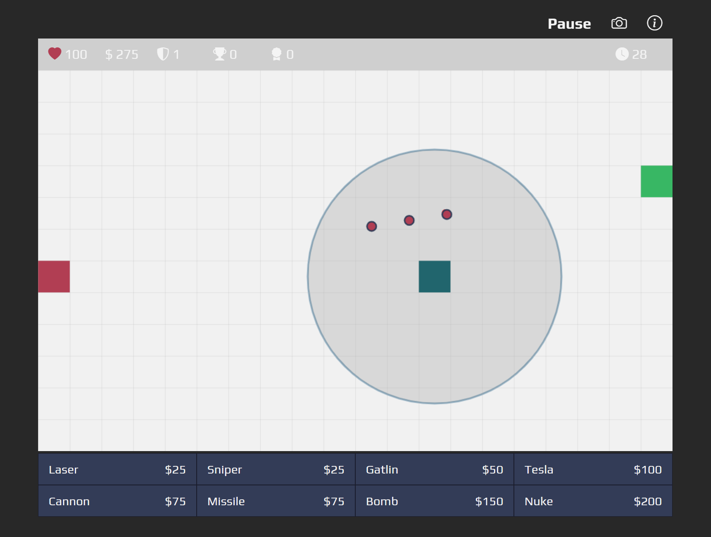

# Tower Defense

## Description

I have always enjoyed creating games with JavaScript. Since I have gotten more experience with JavaScript I figured it was a good time to create a new project showcasing my skills I have learned over the years. Throughout this project I have learned better ways manage JavaScript canvas animation loops and user interactions.

---

## Table of Contents

- [Links](#links)
- [Usage](#usage)
- [Credits](#credits)
- [Badges](#badges)
- [How to Contribute](#How_to_contribute)

## Links

- [Demo Link](https://aaron-soto.github.io/tower-defense/)
- [Code Link](https://github.com/aaron-soto/tower-defense)

## Usage

Once the game has started a user can place towers down to stop the enemies from going from their base (red) to the players base (green). Towers will be able to be upgraded or sold and the enemies will have a path finding algorithm to calculate the best route to the players base.

## Credits

This project has only been worked on by myself at the moment. Maybe your name can be added here one day?

---

## Badges

Badges aren't necessary, per se, but they demonstrate street cred. Badges let other developers know that you know what you're doing. Check out the badges hosted by [shields.io](https://shields.io/). You may not understand what they all represent now, but you will in time.

## How to Contribute

